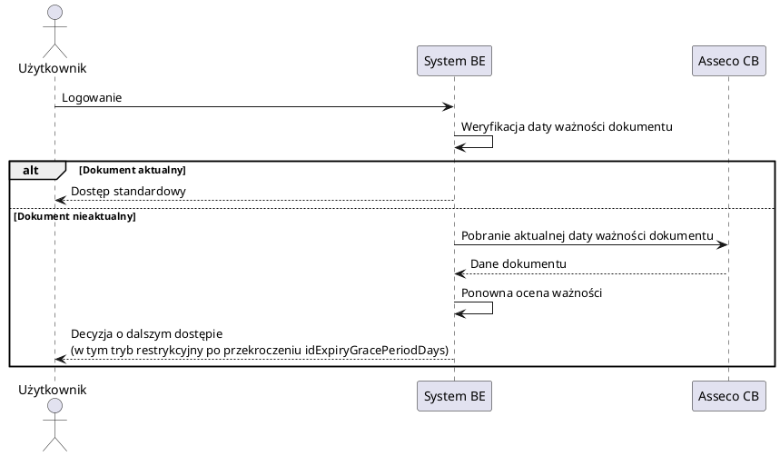

<!-- AI-CONSTRAINTS
Zakres: Opis zakresu modyfikacji
Format: RQ-###
Źródła: 
    Wymagania klienta: src/*, 
    Dokumentacja systemu: doc/*
    Parametry projektu: /project-parameters.md
-->

# Specyfikacja wymagań – BPS Blokowanie dostępu do BE po dacie ważnosci dokumentu tożsamości

## 1. Wprowadzenie

### 1.1 Cel biznesowy projektu
<!-- SPW-SECTION
Cel: Opisz główny cel biznesowy rozwiązania dla wskazanego zakresu modyfikacji.
    Przykład: 
    Celem biznesowym projektu jest umożliwienie klientom bankowości elektronicznej (web i mobile) samodzielnego pobrania ostatniego wyciągu z rachunku w formacie elektronicznym (np. PDF, csv) w celu zwiększenia poziomu samoobsługi, redukcji kosztów operacyjnych oraz poprawy doświadczenia użytkownika.
    Nie stosuj zaspiów w stylu: 
    Celem bizesowym jest dodanie opcji "Pobierz ostatni wyciąg".
Zakres: Perspektywa biznesowa (nie opis implementacji IT).
Źródła: Wymagania klienta: src/*
Wyjście: 3–5 zdań.
Kryteria jakości: jednoznaczność, brak domysłów, spójność terminologii.
-->
Celem biznesowym projektu jest ograniczenie ryzyka operacyjnego i regulacyjnego wynikającego z dostępu do bankowości elektronicznej przez Użytkowników z nieważnym dokumentem tożsamości. System ma automatycznie weryfikować ważność dokumentu po zalogowaniu oraz, po przekroczeniu zdefiniowanego okresu karencji, ograniczać dostęp do funkcji systemu. Jednocześnie rozwiązanie ma zachować ciągłość obsługi procesu aktualizacji danych identyfikacyjnych przez pozostawienie dostępu do miniaplikacji **Wnioski**. Zmiana obejmuje kanały desktop, mobile oraz logowanie w scenariuszu szybkich płatności PayByNet.

### 1.2 Wymagania klienta
<!-- SPW-SECTION
Cel: Przenieś i streść wymagania przekazane przez Klienta.
Źródła: Wymagania klienta: src/*
Wyjście: lista wymagań/założeń z odnośnikami do źródeł.
-->
- System BE ma weryfikować ważność dokumentu tożsamości po zalogowaniu Użytkownika.
- Gdy dokument jest nieaktualny, BE ma odświeżyć datę ważności dokumentu przez pobranie danych z systemu Asseco CB.
- Jeżeli po odświeżeniu dokument nadal jest nieaktualny, BE ma zweryfikować parametr `idExpiryGracePeriodDays` i po przekroczeniu tej wartości uruchomić tryb restrykcyjny.
- W trybie restrykcyjnym Użytkownik ma otrzymać komunikat i mieć dostęp wyłącznie do opcji **Wnioski** (wniosek w Ferryt do aktualizacji danych dokumentu tożsamości).
- Tryb restrykcyjny ma działać dla desktop i mobile; w mobile ma blokować przejście do generowania kodu BLIK.
- Zmiana ma obejmować również logowanie dla szybkich płatności PBN (PayByNet).

**Źródło:** `src/wymagania.md:14-17`

## 2. Perspektywa biznesowa rozwiązania

### 2.1. Słownik pojęć
<!-- SPW-SECTION
Cel: Zdefiniuj terminy używane w dokumencie (lub wskaż, że obowiązuje słownik źródłowy).
Źródła: Dokumentacja systemu: doc/* (np. doc/glossary.md)
Wyjście: lista pojęć i definicji; bez wprowadzania nowych znaczeń.
-->
- **BE** - system bankowości elektronicznej.
- **CB** - Asseco Core Banking, system źródłowy danych klienta dla BE.
- **PayByNet (PBN)** - tryb logowania po przekierowaniu z systemu zewnętrznego PayByNet z częściowym dostępem do funkcjonalności.
- **BLIK** - usługa płatności; kod BLIK może być generowany także ze strony logowania aplikacji mobilnej.
- **Wnioski** - miniaplikacja BE wykorzystywana do obsługi procesów wnioskowych.
- **`idExpiryGracePeriodDays`** - parametr wskazany przez Klienta, określający liczbę dni od daty ważności dokumentu tożsamości, po której dostęp ma zostać zablokowany; parametr konfigurowany w BackOffice, wartość domyślna: 30 dni.
- **Tryb restrykcyjny** - tryb wskazany przez Klienta, w którym dostęp użytkownika jest ograniczony.
- **Ferryt** - nazwa systemu wskazana przez Klienta jako miejsce obsługi wniosku aktualizacji danych dokumentu tożsamości.

**Źródła:** `doc/glossary.md:1-6`, `doc/EBP/Main.adoc:53-55`, `doc/mobile/blik_t6_generowanie_kodu.adoc:8-9`, `doc/CBP/Miniaplikacja_Ubezpieczenia.adoc:44`, `src/wymagania.md:15-17`

### 2.2. Stan obecny
<!-- SPW-SECTION
Cel: Opisz stan obecny w zakresie objętym zmianą (as-is).
Źródła: Dokumentacja systemu: doc/*
Wyjście: krótki opis + kluczowe ograniczenia i zależności.
-->
System BE działa w kanałach desktop i mobile, a dostęp do funkcji jest sterowany uprawnieniami. BE ma tryby logowania obejmujące pełny dostęp oraz logowanie po przekierowaniu z PayByNet z częściowym dostępem. W dokumentacji istnieje funkcjonalność informowania o wygasającym lub wygasłym dokumencie tożsamości po zalogowaniu (komunikat na pulpicie), jednak bez jednoznacznego opisu globalnego trybu restrykcyjnego opartego o `idExpiryGracePeriodDays`.

Kluczowe fakty as-is:
- BE pobiera dane klienta z CB przez API.
- Dla dokumentu tożsamości istnieje prezentacja daty ważności i walidacja daty przy edycji danych użytkownika.
- W mobile opcja **Kod BLIK** jest dostępna z ekranu przed zalogowaniem.
- W systemie istnieje miniaplikacja **Wnioski**.
- W systemie istnieją inne mechanizmy blokowania logowania (np. blokady operatorskie/klienckie), ale dokumentacja nie wiąże ich z datą ważności dokumentu tożsamości.

Ograniczenia i zależności:
- Parametr `idExpiryGracePeriodDays` jest konfigurowany w BackOffice i ma wartość domyślną 30 dni; brak potwierdzenia pełnego zakresu dopuszczalnych wartości (`OPEN-QUESTION-001`).
- Brak opisu as-is przepływu "wniosek aktualizacji dokumentu tożsamości w Ferryt" (`OPEN-QUESTION-002`).
- Brak opisu as-is zachowania logowania PayByNet przy nieważnym dokumencie tożsamości (`OPEN-QUESTION-003`).

**Źródła:** `doc/system-state/kluczowe-wytyczne-stan-obecny-systemu.md:22-32`, `doc/CB/opis-systemu-CB (BE).md:34`, `doc/CBP/Main.adoc:1048-1114`, `doc/EBP/Main.adoc:1143-1152`, `doc/EBP/Main.adoc:1218-1244`, `doc/mobile/logowanie.adoc:45`, `doc/mobile/blik_t6_generowanie_kodu.adoc:8-9`, `doc/CBP/Miniaplikacja_Ubezpieczenia.adoc:44`, `doc/EBP/Main.adoc:53-55`, `doc/BO/BackofficeUserGuide-pl.adoc:562-563`

### 2.3. Model rozwiązania #zakres bazowy
<!-- SPW-SECTION
Cel: Opisz docelowy model rozwiązania w zakresie zmian (to-be) na poziomie biznesowym.
Źródła: src/*, doc/*
Wyjście: opis przepływu + kluczowe decyzje biznesowe.
-->
Model docelowy zakłada kontrolę ważności dokumentu tożsamości jako krok wykonywany po zalogowaniu użytkownika. Jeżeli dokument jest nieaktualny, system aktualizuje datę ważności z CB i ponownie ocenia status dokumentu. Jeżeli dokument nadal jest nieważny i przekroczono `idExpiryGracePeriodDays`, system uruchamia tryb restrykcyjny: prezentuje komunikat, ogranicza dostęp do **Wniosków** i blokuje wejście do generowania kodu BLIK w kanale mobile. Ta sama reguła ma obejmować logowanie w trybie PayByNet.

Kluczowe decyzje biznesowe:
- Kontrola dotyczy kanałów desktop i mobile.
- Okres karencji jest parametryzowany (`idExpiryGracePeriodDays`).
- Użytkownik zachowuje możliwość zainicjowania procesu aktualizacji danych przez **Wnioski**.

## 3. Wymagania szczegółowe
<!-- SPW-SECTION
Cel: W niniejszym rozdziale jest dokonane mapowanie modelu rozwiązania na nowe i modyfikowane wymagania/user stories.
Przykład:
Opis: 
[Krótki opis wymagania]
Dodanie opcji pobrania ostatniego wyciągu.

Stan obecny:
[Opis stanu obecnego as-is na podstawie /doc/**. UWAGA! Jeżeli nie znaleziono informacji o danej funkcjonalności w systemie to należy dodać opis, że danej funkcjonlaności nie ma w systemie!]
Obecnie w sytemie Asseco EBP użytkonik ma możliwość przejścia z poziomu rachunku do opcji podglądu listy wyciągów danego rachunku. System po wejściu w opcję, prezentuje listę wyciągów z możliwością pobrania w formacie pdf, csv.

Opis modyfikacji:
[Opis modyfikacji to-be na postawie wymagań Klieta /src/wymagania.md]
Zmiana polegała będzie na dodaniu na poziomoie listy rachunków (miniaplikacja Rachunki) nowej opcji "Ostatni wyciąg". Opcja pozwoli użytkownikowi na pobiranie ostatniego (najnowszego) wyciągu bez potrzeby wchodzenia w listę wyciągów.

Źródła: 
Wymagania klienta: src/*
Stan obecny (as-is): doc/**
AC: (pilnuj wcięć dla każej z lini Given/When/Then)
-->
### 3.1 Wymagania funkcjonalne

#### RQ-001: Weryfikacja ważności dokumentu po zalogowaniu i odświeżenie danych z CB
**Opis:** System po zalogowaniu Użytkownika weryfikuje ważność dokumentu tożsamości i, jeśli dokument jest nieaktualny, odświeża datę ważności przez pobranie danych z Asseco CB.

**Stan obecny:** 
- BE pobiera dane klienta z systemu CB przez API.
- Dokumentacja opisuje prezentację statusu ważności dokumentu na pulpicie po zalogowaniu.
- Dokumentacja opisuje dane dokumentu tożsamości i walidację daty ważności przy edycji danych osobowych.

**Opis modyfikacji:** 
- Wprowadzić obowiązkową kontrolę ważności dokumentu tożsamości po każdym zalogowaniu.
- Dla dokumentu nieaktualnego wykonać odświeżenie daty ważności z CB.
- Dalszą decyzję o dostępie opierać na danych po odświeżeniu.

**Źródła:**
- Wymaganie klienta: `src/wymagania.md:14-15`
- Stan obecny (as-is): `doc/CB/opis-systemu-CB (BE).md:34`, `doc/CBP/Main.adoc:1048-1114`, `doc/EBP/Main.adoc:1143-1152`, `doc/EBP/Main.adoc:1218-1244`

**AC:** 
- Given Użytkownik loguje się do BE
- When system rozpoczyna sesję użytkownika
- Then system weryfikuje ważność dokumentu tożsamości
- Given dokument tożsamości jest nieważny wg danych lokalnych BE
- When system pobierze aktualne dane dokumentu z CB
- Then system podejmuje decyzję o dalszym dostępie na podstawie odświeżonej daty ważności

---

#### RQ-002: Tryb restrykcyjny po przekroczeniu okresu karencji
**Opis:** System uruchamia tryb restrykcyjny, jeżeli po odświeżeniu z CB dokument pozostaje nieważny i przekroczono wartość parametru `idExpiryGracePeriodDays`.

**Stan obecny:** 
- Dokumentacja opisuje ostrzeżenia o wygasaniu/wygaśnięciu dokumentu tożsamości po zalogowaniu.
- W systemie istnieje miniaplikacja **Wnioski**.
- W dokumentacji występują inne mechanizmy blokowania logowania, niezwiązane z ważnością dokumentu tożsamości.
- Parametr `idExpiryGracePeriodDays` jest konfigurowany w BackOffice i ma wartość domyślną 30 dni.

**Opis modyfikacji:** 
- Dodać ocenę parametru `idExpiryGracePeriodDays` po odświeżeniu danych z CB.
- Po przekroczeniu progu uruchamiać tryb restrykcyjny.
- W trybie restrykcyjnym prezentować komunikat i ograniczać dostęp wyłącznie do opcji **Wnioski** (zgodnie z wymaganiem klienta).

**Źródła:**
- Wymaganie klienta: `src/wymagania.md:15`
- Stan obecny (as-is): `doc/CBP/Main.adoc:1048-1114`, `doc/CBP/Miniaplikacja_Ubezpieczenia.adoc:44`, `doc/BO/BackofficeUserGuide-pl.adoc:562-563`

**AC:**
- Given dokument użytkownika po odświeżeniu z CB jest nieważny
- When liczba dni od daty ważności przekroczy `idExpiryGracePeriodDays`
- Then system uruchamia tryb restrykcyjny
- Given użytkownik znajduje się w trybie restrykcyjnym
- When użytkownik próbuje przejść do funkcji innej niż **Wnioski**
- Then system blokuje dostęp do tej funkcji i pozostawia dostęp wyłącznie do **Wniosków**

---

#### RQ-003: Ograniczenie dostępu do generowania kodu BLIK w mobile
**Opis:** W trybie restrykcyjnym system blokuje w kanale mobile przejście do opcji generowania kodu BLIK.

**Stan obecny:** 
- W aplikacji mobilnej użytkownik może przejść do ekranu generowania kodu BLIK również przed zalogowaniem.
- Ekran logowania udostępnia opcję **Kod BLIK**.

**Opis modyfikacji:** 
- Dla użytkownika objętego trybem restrykcyjnym zablokować wejście do funkcji generowania kodu BLIK w kanale mobile.

**Źródła:**
- Wymaganie klienta: `src/wymagania.md:15`
- Stan obecny (as-is): `doc/mobile/blik_t6_generowanie_kodu.adoc:8-9`, `doc/mobile/logowanie.adoc:45`

**AC:**
- Given użytkownik loguje się do mobile i ma aktywny tryb restrykcyjny
- When użytkownik wybiera opcję **Kod BLIK**
- Then system nie udostępnia ekranu generowania kodu BLIK
- Given użytkownik nie ma aktywnego trybu restrykcyjnego
- When użytkownik wybiera opcję **Kod BLIK**
- Then system udostępnia funkcję zgodnie z aktualnym zachowaniem

---

#### RQ-004: Standardowy przebieg logowania przy dokumencie ważnym lub w okresie karencji
**Opis:** System realizuje standardowe logowanie, jeżeli dokument jest ważny albo nie został przekroczony parametr `idExpiryGracePeriodDays`.

**Stan obecny:** 
- System posiada standardowe logowanie do pełnej funkcjonalności.
- Logowanie przebiega z wykorzystaniem zdefiniowanych metod uwierzytelniania.

**Opis modyfikacji:** 
- Utrzymać standardowy przebieg logowania dla użytkowników, którzy nie spełniają warunków trybu restrykcyjnego.

**Źródła:**
- Wymaganie klienta: `src/wymagania.md:15`
- Stan obecny (as-is): `doc/EBP/Main.adoc:53-63`, `doc/CBP/Main.adoc:60-70`

**AC:**
- Given dokument użytkownika jest ważny
- When użytkownik loguje się do BE
- Then system udostępnia standardowy zakres funkcjonalności
- Given dokument użytkownika jest nieważny, ale nie przekroczono `idExpiryGracePeriodDays`
- When użytkownik loguje się do BE
- Then system udostępnia standardowy zakres funkcjonalności

---

#### RQ-005: Zastosowanie reguł kontroli dokumentu dla logowania PayByNet (PBN)
**Opis:** Reguły kontroli ważności dokumentu i trybu restrykcyjnego obejmują także logowanie po przekierowaniu z PayByNet.

**Stan obecny:** 
- W systemie istnieje tryb logowania po przekierowaniu z PayByNet z częściowym dostępem.
- W BackOffice występuje raportowanie i statusy transakcji PayByNet.
- Brak opisu as-is reguł ważności dokumentu tożsamości dla trybu PayByNet.

**Opis modyfikacji:** 
- Rozszerzyć kontrolę ważności dokumentu i decyzję o trybie restrykcyjnym na scenariusz logowania PayByNet.

**Źródła:**
- Wymaganie klienta: `src/wymagania.md:17`
- Stan obecny (as-is): `doc/EBP/Main.adoc:53-55`, `doc/CBP/Main.adoc:60-62`, `doc/BO/BackofficeUserGuide-pl.adoc:9578-9594`

**AC:**
- Given użytkownik loguje się do BE po przekierowaniu z PayByNet
- When dokument po odświeżeniu z CB jest nieważny i przekroczono `idExpiryGracePeriodDays`
- Then system uruchamia tryb restrykcyjny także w tym trybie logowania
- Given użytkownik loguje się do BE po przekierowaniu z PayByNet
- When dokument jest ważny albo nie przekroczono `idExpiryGracePeriodDays`
- Then system realizuje standardowy przebieg logowania dla trybu PayByNet

---

#### 3.1.1 Obsługa błędów
(Ta sekcja MUSI istnieć)
- W trybie restrykcyjnym system prezentuje użytkownikowi komunikat o ograniczeniu dostępu i udostępnia wyłącznie przejście do **Wniosków**.
- `OPEN-QUESTION-004`: Brak w źródłach treści komunikatów i wariantów językowych dla trybu restrykcyjnego (desktop, mobile, PayByNet).
- `OPEN-QUESTION-005`: Brak opisu zachowania systemu, gdy odświeżenie daty ważności dokumentu z CB zakończy się błędem technicznym.
- `OPEN-QUESTION-006`: Brak opisu zachowania systemu, gdy miniaplikacja **Wnioski** lub proces Ferryt są czasowo niedostępne przy aktywnym trybie restrykcyjnym.

---

### 3.2 Wymagania niefunkcjonalne
<!-- SPW-SECTION
Cel: Zdefiniuj wymagania niefunkcjonalne dla zakresu zmian.
Źródła: src/*, doc/*
Wyjście: wymagania testowalne + mierzalne kryteria akceptacji, jeśli możliwe.
-->
---
#### 3.2.1. Wydajność
- Źródła nie definiują wymagań wydajnościowych dla dodatkowej walidacji po logowaniu.
- `OPEN-QUESTION-007`: Jaki jest maksymalny dopuszczalny czas logowania po dodaniu weryfikacji dokumentu i odświeżenia z CB?
#### 3.2.2. Bezpieczeństwo
- System ogranicza dostęp do funkcji BE po przekroczeniu parametru `idExpiryGracePeriodDays` dla nieważnego dokumentu tożsamości.
- Ograniczenie dostępu obejmuje kanały desktop i mobile oraz scenariusz logowania PayByNet.
- W kanale mobile tryb restrykcyjny blokuje przejście do generowania kodu BLIK.
#### 3.2.3. Wdrożenie i proces migracji danych
- W źródłach nie zdefiniowano migracji danych dla tego zakresu zmiany.
- `OPEN-QUESTION-008`: Czy wartość domyślna `idExpiryGracePeriodDays` = 30 dni ma zostać utrzymana dla wszystkich tenantów, czy bank przewiduje wyjątki per tenant/per segment?
## 5. Wymagane licencje
<!-- SPW-SECTION
Cel: Wskaż licencje / zależności licencyjne wymagane przez rozwiązanie.
Źródła: src/*, doc/*
Wyjście: lista licencji i zakres ich użycia.
Generowanie: POMIŃ (ten rozdział uzupełniany ręcznie)
-->
---
## 6. Obszary pod wpływem
<!-- SPW-SECTION
Cel: Wymień systemy, moduły, procesy i kanały dotknięte zmianą.
Źródła: src/*, doc/*
Wyjście: lista obszarów + krótki opis wpływu.
Generowanie: POMIŃ (ten rozdział uzupełniany ręcznie)
-->
---
## 7. Założenia i ograniczenia
<!-- SPW-SECTION
Cel: Zapisz założenia, ograniczenia oraz decyzje projektowe wpływające na zakres.
Źródła: src/*, doc/*
Wyjście: lista punktów; brakujące dane oznaczaj OPEN-QUESTION.
Generowanie: POMIŃ (ten rozdział uzupełniany ręcznie)
-->

## 8. Zagadnienia otwarte
- OPEN-QUESTION-001: Parametr `idExpiryGracePeriodDays` jest w BackOffice (wartość domyślna 30 dni); brak potwierdzenia pełnego zakresu dopuszczalnych wartości.

- OPEN-QUESTION-002: Brak opisu as-is procesu „wniosek aktualizacji danych dokumentu tożsamości” w systemie Ferryt (wejście, wymagane dane, statusy).
- OPEN-QUESTION-003: Brak opisu as-is zachowania logowania PayByNet dla użytkownika z nieważnym dokumentem tożsamości.
- OPEN-QUESTION-004: Brak docelowej treści komunikatów dla trybu restrykcyjnego w kanałach desktop/mobile/PayByNet.
- OPEN-QUESTION-005: Brak reguły postępowania przy błędzie integracji BE->CB podczas odświeżenia daty ważności dokumentu.
- OPEN-QUESTION-006: Brak reguły postępowania przy niedostępności miniaplikacji **Wnioski** lub procesu Ferryt w trybie restrykcyjnym.
- OPEN-QUESTION-007: Brak wymaganego SLA/czasu odpowiedzi dla logowania z dodatkową kontrolą dokumentu.
- OPEN-QUESTION-008: Brak decyzji wdrożeniowej, czy domyślne `idExpiryGracePeriodDays` = 30 dni obowiązuje globalnie, czy z wyjątkami per bank/per tenant/per segment.
- OPEN-QUESTION-009: Brak jednoznacznego wskazania, czy zakres zmiany dotyczy wyłącznie dokumentu „dowód osobisty”, czy wszystkich typów dokumentów tożsamości.
- OPEN-QUESTION-010: Brak jednoznacznego wskazania, czy i jak tryb restrykcyjny ma wpływać na logowanie kodem QR w kanale mobile.
## 9. Załączniki
<!-- SPW-SECTION
Cel: Dołącz lub wskaż materiały referencyjne (np. diagramy, tabele, słowniki, zrzuty).
Źródła: src/*, doc/*
Wyjście: lista załączników + identyfikatory/odnośniki.
Generowanie: POMIŃ (ten rozdział uzupełniany ręcznie)
-->
